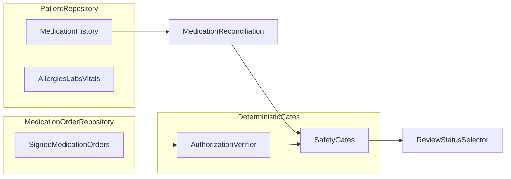
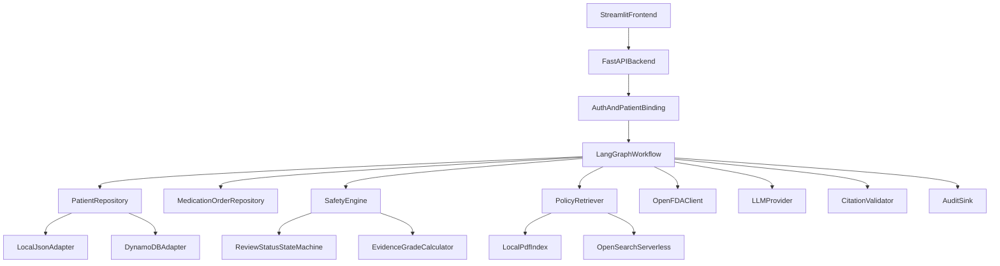
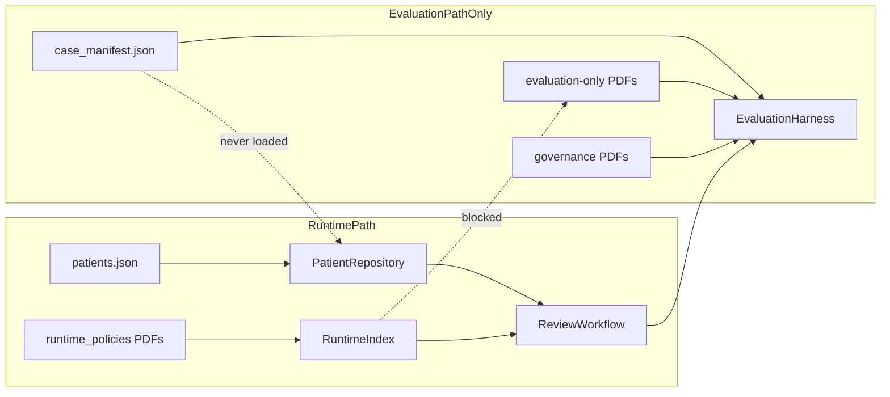

# Cardiologist Clinical Review Agent — Implementation Plan

## 1. Repository Artifact Inventory (Observed Facts)

### Patient and evaluation data

| Path | Format (verified) | Count / size | Purpose | Classification |
|------|-------------------|--------------|---------|----------------|
| [`data/patients/runtime/patients.json`](data/patients/runtime/patients.json) | **Native JSON array** of patient objects (not DynamoDB AttributeValue, not JSONL) | **100 patients** (`P1001`–`P1100`; 100 `"patient_id"` occurrences) | **Canonical runtime patient source** | Present and usable |
| [`data/patients/evaluation/case_manifest.json`](data/patients/evaluation/case_manifest.json) | JSON array of evaluation entries | **100 entries** (1:1 with patients) | Scenario tags + expected review status | Present; **evaluation-only — must not load into Patients table** |
| [`data/patients/validation/validation_summary.json`](data/patients/validation/validation_summary.json) | JSON object | 1 file | Dataset counts, validation pass/fail, explicit authorization limitation | Present; governance metadata, not runtime input |
| [`data/patients/tools/load_patients.py`](data/patients/tools/load_patients.py) | Python script | 1 file | Optional boto3 loader: reads native JSON, `put_item` per patient to DynamoDB `Patients` table | Present and usable (AWS optional) |
| [`data/patients/tools/README.md`](data/patients/tools/README.md) | Markdown | 1 file | Documents schema, loader, safety design | Present; **partially stale** (references missing files) |
| [`data/patients/problem_statement.txt`](data/patients/problem_statement.txt) | Plain text | 1 file | Problem description + example schema | Present; reference only |

**Not found (despite README mentions):**
- `patients.jsonl` — **expected but not found**
- `dynamodb_batches/batch_*.json` — **expected but not found** (loader uses native JSON directly, not AttributeValue batch envelopes)
- Medication-order / authorization data — **expected but not found**
- RAGAS reference answers / gold contexts — **expected but not found**

**Untracked:** [`data/.env`](data/.env) — treat as local secrets; never commit.

### RAG policy PDFs — **21 total**, all readable (text extractable)

**Runtime clinical/workflow policy evidence (17 PDFs)** — [`data/rag/runtime_policies/`](data/rag/runtime_policies/)

| File | Observed doc ID (from PDF header) |
|------|-----------------------------------|
| `01_clinical_governance_and_authorisation.pdf` | (runtime policy) |
| `02_medication_initiation_monitoring_timelines.pdf` | |
| `03_medication_administration_and_patient_instructions.pdf` | |
| `04_booking_referrals_and_appointment_procedures.pdf` | |
| `05_safety_escalation_and_red_flags.pdf` | |
| `06_prohibited_actions_and_high_risk_controls.pdf` | |
| `07_staff_directory_and_contact_routes.pdf` | |
| `08_diagnostic_testing_and_results_management.pdf` | |
| `09_longitudinal_care_and_followup_plans.pdf` | |
| `11_data_quality_reconciliation_and_record_correction.pdf` | |
| `12_uncertainty_conflict_resolution_and_abstention.pdf` | |
| `14_interactions_allergies_contraindications_and_duplication.pdf` | |
| `15_knowledge_freshness_supersession_and_source_withdrawal.pdf` | |
| `16_peri_procedure_and_temporary_medication_hold_policy.pdf` | |
| `17_downtime_dependency_failure_and_safe_degradation.pdf` | |
| `18_evidence_review_status_and_claim_citation_addendum.pdf` | |
| `19_final_medication_recommendation_authorisation_addendum.pdf` | NB-GOV-102 |

**Governance / configuration evidence (2 PDFs)** — [`data/rag/governance/`](data/rag/governance/)

| File | Observed doc ID | Runtime retrieval |
|------|-----------------|-------------------|
| `00_corpus_guide_and_retrieval_rules.pdf` | NB-RAG-000 | Controls ingestion/retrieval behavior; **not patient-specific medication evidence** |
| `13_rag_and_model_evaluation_governance.pdf` | NB-AI-901 | Evaluation/release governance; **not clinical evidence for patient recommendations** |

**Evaluation-only material (2 PDFs)** — [`data/rag/evaluation-only/`](data/rag/evaluation-only/) — **must never enter runtime OpenSearch index**

| File | Observed doc ID | Rule (from PDF) |
|------|-----------------|-----------------|
| `10_worked_synthetic_patient_review_cases.pdf` | NB-TRN-701 | "Never treat a worked case as evidence for another patient" |
| `20_adversarial_uncertainty_and_failure_worked_cases.pdf` | (evaluation) | Adversarial/failure cases |

Filesystem already separates runtime vs evaluation vs governance — ingestion must enforce this via explicit configured paths and metadata, not recursive directory walks.

### Application code

**No application source code exists.** This is a greenfield build. Only the `data/` tree is committed.

---

## 2. Artifact Validation Findings

### Canonical patient source
- **Use exactly:** [`data/patients/runtime/patients.json`](data/patients/runtime/patients.json)
- **Do not load:** `case_manifest.json`, `validation_summary.json`, README, loader script, or any future batch envelopes as patient items

### Patient schema (observed top-level fields)
`patient_id`, `first_name`, `last_name`, `date_of_birth`, `gender`, `smoking_status`, `family_history_cardiovascular_disease`, `primary_cardiologist`, `conditions[]`, `medications[]`, `allergies[]`, `lab_results[]`, `vital_signs[]`, `cardiology_tests[]`, `created_at`, `updated_at`, `source`, `status`

Nested lists use `record_id` prefixes (`C`, `M`, `A`, `L`, `V`, `T`). Each patient is one nested document suitable for DynamoDB single-item storage.

### Record counts (from validation summary — consistent with inspection)
- Conditions: 303 | Medications: 310 | Allergies: 35 entries across patients | Labs: 825 | Vitals: 208 | Cardiology tests: 208

### Allergy reconciliation gap
- **65 patients** have `"allergies": []` (empty list)
- **35 allergy records** exist (non-empty entries)
- P1095–P1097 (`allergy_status_unknown` scenarios): empty allergy list **with condition notes stating "allergy reconciliation not recorded"** — must **not** be interpreted as "no known allergies"

### Medication history vs authorization
Medication objects contain: `drug_name`, `dose`, `dose_unit`, `frequency`, `route`, `medication_status` (Active/Stopped observed), `start_date`, `end_date`, `prescriber`, `indication`, provenance fields.

**Confirmed absent** (grep across entire file): `order_id`, `authorization`, `signed`, `formulation`, `missed_dose`, `reconciliation` status fields.

Example conflict case P1063: duplicate `Atorvastatin` — one Active (M001), one Stopped (M007) — medication **history conflict**, not a signed order.

### Scenario coverage (case manifest)
All 100 patients tagged. **No case expects `FINAL_AUTHORIZED`.** Expected statuses:
- `DRAFT_FOR_CLINICIAN_REVIEW` — 55 (P1001–P1055)
- `INSUFFICIENT_EVIDENCE` — 14 (stale monitoring, preliminary tests, unknown allergy status)
- `CONFLICT_REQUIRES_REVIEW` — 15 (medication conflicts, allergy conflicts, peri-procedure gaps)
- `URGENT_CLINICAL_REVIEW` — 11 (high potassium + ACE/ARB, bradycardia, unreviewed abnormal labs)
- `EMERGENCY_ESCALATION` — 4 (severe hypoxia proxy)
- `SYSTEM_UNAVAILABLE` — 1 (P1100, patient `status: "Inactive"`)

### PDF corpus
- 21 PDFs, all text-extractable
- Document metadata (ID, version, effective/review dates) embedded in PDF headers — suitable for deterministic inventory mapping
- No blockers for ingestion planning

### Blockers
**None for planning or local-first vertical slice.** Minimum patient dataset and RAG corpus are present and parseable.

**Design blocker (not repository blocker):** `FINAL_AUTHORIZED` is unreachable with current data — by design.

---

## 3. Authorization Gap Analysis

### Confirmed gap
Three independent sources agree:
1. [`validation_summary.json`](data/patients/validation/validation_summary.json) — `"important_limitation"` field
2. [`data/patients/tools/README.md`](data/patients/tools/README.md) — schema limitation section
3. Actual medication records — `prescriber` only; no signed-order fields

`prescriber: "DR101"` is a **medication history attribution**, not proof of a current signed authorization with complete administration instructions.

### Recommended design



**Keep separate:**
- `MedicationHistoryRecord` — from patient JSON (`medications[]`)
- `MedicationOrder` — from dedicated authorization source (not yet supplied)

**Phase 1–4 behavior:** `MedicationOrderRepository` returns `AuthorizationUnavailable` for all patients. `FINAL_AUTHORIZED` gate always fails.

**Statuses achievable with current data only:**

| Status | When |
|--------|------|
| `DRAFT_FOR_CLINICIAN_REVIEW` | Safety gates pass for routine cases; synthesis allowed; no signed order |
| `INSUFFICIENT_EVIDENCE` | Missing/stale monitoring, preliminary results, unknown allergy reconciliation, retrieval gaps |
| `CONFLICT_REQUIRES_REVIEW` | Medication duplicates/status conflicts, allergy-medication conflicts, peri-procedure gaps |
| `URGENT_CLINICAL_REVIEW` | High potassium + ACE/ARB, bradycardia + rate-limiting meds, unreviewed abnormal labs |
| `EMERGENCY_ESCALATION` | Severe hypoxia proxy and similar hard-stop vitals |
| `SYSTEM_UNAVAILABLE` | Inactive patient record, critical dependency failure |
| `FINAL_AUTHORIZED` | **Impossible** until verified signed order source exists |

---

## 4. Proposed Repository Tree

**Existing (unchanged):**
```
data/
  patients/runtime/patients.json          # canonical runtime source
  patients/evaluation/case_manifest.json    # evaluation only
  patients/validation/validation_summary.json
  patients/tools/
  rag/runtime_policies/                     # 17 PDFs
  rag/governance/                           # 2 PDFs
  rag/evaluation-only/                      # 2 PDFs
```

**Proposed (new):**
```
src/
  cardiologist_agent/
    domain/           # Pydantic v2 models
    repositories/     # Patient, MedicationOrder, Policy, OpenFDA interfaces + adapters
    safety/           # Validation, reconciliation, conflict detection, status/grade engines
    retrieval/        # PDF ingestion, chunking, local index, OpenSearch adapter
    workflow/         # LangGraph graph, nodes, state
    api/              # FastAPI routes, auth middleware
    providers/        # LLM provider interface (OpenAI, Azure stub)
    evaluation/       # RAGAS runner, deterministic test harness
  streamlit_app/      # Streamlit UI
tests/
  unit/
  integration/
  safety/
  evaluation/
config/
  corpus_inventory.yaml     # explicit PDF paths + metadata classification
  retrieval_allowlist.yaml  # runtime-eligible categories/statuses
  safety_thresholds.yaml    # deterministic thresholds (stale days, K+ limits, etc.)
scripts/                    # ingest, validate, evaluate (no data fabrication)
docker/
pyproject.toml
README.md
.gitignore                  # exclude data/.env, indexes, caches
```

**Explicitly not created without approval:**
- `data/patients/runtime/medication_orders.json`
- `data/patients/dynamodb_batches/`
- RAGAS gold answer files

---

## 5. Component Architecture



**Deterministic layer owns:** validation, reconciliation, authorization verification, conflict/hard-stop detection, corpus filtering, evidence sufficiency, status/grade selection, citation validation, output schema enforcement.

**LLM owns:** tool selection within allowlist, synthesis of verified facts, schema-constrained drafting, uncertainty expression — **never** finalization or authorization inference.

---

## 6. Runtime vs Evaluation Data Flow



**Mandatory metadata on every chunk:**
`document_id`, `canonical_title`, `version`, `effective_date`, `review_date`, `status`, `owner`, `document_category`, `corpus_eligibility` (`runtime` | `governance` | `evaluation`), `synthetic=true`, `section_path`, `page`, `source_path`, `content_hash`, `chunk_id`, `index_version`

**Runtime retrieval filter (allowlist):**
- `corpus_eligibility = runtime`
- `status = active` (not superseded/withdrawn)
- Explicit denylist: `NB-TRN-701`, adversarial doc ID, any `evaluation-only/` path

**Governance docs (NB-RAG-000, NB-AI-901):** loaded into separate governance index or tagged `corpus_eligibility=governance`; retrievable for retrieval-rule conflicts and evaluation design, **not** as patient-specific medication evidence.

---

## 7. Pydantic Domain and API Schemas (Key Types)

### Domain
- `Patient`, `Condition`, `MedicationHistoryRecord`, `Allergy`, `LabResult`, `VitalSign`, `CardiologyTest`
- `MedicationOrder` (proposed — see §8)
- `Claim` with `ClaimType`: `PATIENT_FACT | AUTHORIZED_ORDER | POLICY_REQUIREMENT | EXTERNAL_EVIDENCE | MODEL_INTERPRETATION`
- `Citation` — `{source_type, document_id, version, section, page, chunk_id, retrieved_at}`
- `SafetyFlag`, `Conflict`, `MissingDataItem`, `StaleDataItem`
- `RecommendationAction` — `CONTINUE | START | ADJUST | HOLD | STOP | NO_CHANGE | NO_RECOMMENDATION`
- `ReviewStatus` — state machine enum (§9)
- `EvidenceGrade` — `HIGH | MODERATE | LOW | INSUFFICIENT`
- `MedicationRecommendationResponse` — 15-section output contract from requirements

### API
- `POST /api/v1/reviews` — `{patient_id, request_id, clinician_id}` (patient ID bound outside LLM)
- `GET /api/v1/patients/{patient_id}/summary` — read-only structured snapshot
- `GET /api/v1/health`
- Response always includes `review_status`, `evidence_grade`, typed `claims[]`, `limitations`, `safest_next_action`

---

## 8. Proposed `MedicationOrder` Schema (No Data Generated)

```python
# Conceptual — implement as Pydantic v2 models
class AuthorizationStatus(str, Enum):
    SIGNED = "SIGNED"
    PENDING = "PENDING"
    EXPIRED = "EXPIRED"
    REVOKED = "REVOKED"
    SUPERSEDED = "SUPERSEDED"

class MedicationOrder(BaseModel):
    order_id: str
    order_version: int
    patient_id: str
    medication_record_id: str | None  # optional link to history M-record
    drug_name: str
    formulation: str
    strength: str
    dose: Decimal
    dose_unit: str
    route: str
    frequency: str
    timing: str | None
    food_or_formulation_instructions: str | None
    start_date: date
    duration_or_stop_date: date | None
    review_or_expiry_date: date
    missed_dose_instructions: str
    prohibited_self_adjustments: str | None
    temporary_hold_instructions: str | None
    restart_instructions: str | None
    authorization_status: AuthorizationStatus
    authorizing_clinician_id: str
    authorization_timestamp: datetime
    effective_date: date
    recommendation_action: RecommendationAction
```

**Repository interface:**
```python
class MedicationOrderRepository(Protocol):
    async def get_active_orders(self, patient_id: str) -> list[MedicationOrder]: ...
    async def get_order(self, patient_id: str, order_id: str, version: int) -> MedicationOrder | None: ...
```

**Phase 1 adapter:** `UnavailableMedicationOrderRepository` — always returns empty + `AuthorizationSourceStatus.UNAVAILABLE`.

**Phase 5 (requires approval):** load from approved `medication_orders.json` or external system adapter.

---

## 9. Review Status State Machine

**Priority (highest wins):**
1. `EMERGENCY_ESCALATION`
2. `SYSTEM_UNAVAILABLE`
3. `URGENT_CLINICAL_REVIEW`
4. `CONFLICT_REQUIRES_REVIEW`
5. `INSUFFICIENT_EVIDENCE`
6. `FINAL_AUTHORIZED` — requires all gates below
7. `DRAFT_FOR_CLINICIAN_REVIEW`

**FINAL_AUTHORIZED gates (all required):**
- Patient found, active, identity verified
- Allergy reconciliation status known (not empty-without-proof)
- Medication reconciliation complete (no unresolved conflicts)
- No urgent/emergency/conflict flags
- Required monitoring data present and fresh
- No preliminary/unreviewed blocking results
- Signed `MedicationOrder` with `authorization_status=SIGNED`, not expired
- Order passes allergy/contraindication/interaction deterministic checks
- Policy retrieval coverage sufficient for material claims
- All material claims have valid citations
- LLM output passes schema + entailment validation
- No evaluation corpus contamination

---

## 10. Evidence Grade Algorithm (Deterministic)

| Grade | Criteria |
|-------|----------|
| `INSUFFICIENT` | Any hard gate failure, missing authorization, unknown allergy reconciliation, preliminary blocking results, retrieval failure on required policy domain |
| `LOW` | Non-blocking gaps: partial stale data, moderate retrieval coverage, openFDA unavailable but non-critical |
| `MODERATE` | Patient data complete + fresh; policy retrieval adequate; external evidence partial; no signed order (draft outputs) |
| `HIGH` | All above + verified signed order + full citation coverage + no conflicts — **only reachable in Phase 5+ with authorization source** |

No LLM confidence scores. Grade computed from structured gate results.

---

## 11. Conflict Resolution and Safest-Next-Action Matrix (Summary)

| Condition | Status | Safest next action | Withhold |
|-----------|--------|-------------------|----------|
| Inactive patient (P1100) | `SYSTEM_UNAVAILABLE` | Do not review; route to records admin | All recommendations |
| Empty allergies, no reconciliation proof (P1095–P1097) | `INSUFFICIENT_EVIDENCE` | Allergy reconciliation workflow | NKDA assumption |
| Duplicate active/stopped same drug (P1063–P1068) | `CONFLICT_REQUIRES_REVIEW` | Medication reconciliation | Dose instructions |
| Allergy + active med conflict (P1069–P1073) | `CONFLICT_REQUIRES_REVIEW` | Clinician review; hold pending review | Continue instruction |
| High K+ + ACE/ARB (P1074–P1078) | `URGENT_CLINICAL_REVIEW` | Urgent clinician contact per policy 05 | Routine continuation |
| Preliminary cardiology test (P1079–P1082) | `INSUFFICIENT_EVIDENCE` | Await finalized/report review | Test-based plan changes |
| Peri-procedure + anticoagulant, no plan (P1083–P1086) | `CONFLICT_REQUIRES_REVIEW` | Peri-procedure med review per policy 16 | Hold/restart without auth |
| Bradycardia + rate limiter (P1087–P1090) | `URGENT_CLINICAL_REVIEW` | Urgent review | Rate/dose changes |
| Severe hypoxia (P1091–P1094) | `EMERGENCY_ESCALATION` | Emergency escalation per policy 05 | All routine recs |
| Signed order vs allergy/policy conflict | `CONFLICT_REQUIRES_REVIEW` | Human review; never silent execution | Automated fulfillment |
| Evaluation PDF retrieved at runtime | `INSUFFICIENT_EVIDENCE` or abort retrieval | Re-run with filters; audit event | Contaminated claims |

---

## 12. LangGraph Workflow

### State (`ReviewState`)
`request_id`, `patient_id`, `clinician_id`, `patient`, `medication_orders`, `safety_flags`, `conflicts`, `missing_data`, `stale_data`, `retrieved_policies`, `openfda_results`, `verified_facts`, `draft_response`, `claims`, `review_status`, `evidence_grade`, `errors`

### Nodes (24-step pipeline)
1. `authenticate_and_bind_patient`
2. `validate_request`
3. `load_patient`
4. `validate_patient_schema`
5. `verify_patient_status`
6. `reconcile_medications_allergies`
7. `load_medication_orders`
8. `assess_freshness_completeness`
9. `detect_conflicts_and_hard_stops`
10. `detect_urgency_emergency`
11. `classify_retrieval_request`
12. `retrieve_policy_evidence` (metadata-filtered)
13. `retrieve_openfda` (optional/bounded)
14. `validate_source_provenance`
15. `assess_evidence_sufficiency`
16. `build_verified_fact_bundle`
17. `llm_synthesize` (schema-constrained)
18. `validate_output_schema`
19. `validate_claims_and_citations`
20. `reject_contaminated_claims`
21. `select_review_status_and_grade`
22. `assemble_response`
23. `write_audit_event`

### Conditional edges (early exit examples)
- Patient not found → `SYSTEM_UNAVAILABLE`
- Inactive patient → `SYSTEM_UNAVAILABLE`
- Emergency flags → skip LLM synthesis or limited synthesis → `EMERGENCY_ESCALATION`
- Authorization unavailable → never route to `FINAL_AUTHORIZED`
- Evaluation doc in retrieval → sanitize and fail gate
- Citation failure → downgrade status, strip unsupported claims

---

## 13. Typed Interfaces

| Interface | Local adapter (Phase 1–4) | AWS/production adapter |
|-----------|---------------------------|------------------------|
| `PatientRepository` | `LocalJsonPatientRepository(patients.json)` | `DynamoDBPatientRepository` |
| `MedicationOrderRepository` | `UnavailableOrderRepository` | Approved JSON or external EHR adapter |
| `PolicyRetriever` | `LocalPdfIndexRetriever` (BM25 + optional embeddings) | `OpenSearchServerlessRetriever` |
| `OpenFDAClient` | `FakeOpenFDAClient` / recorded fixtures | `LiveOpenFDAClient` with cache |
| `LLMProvider` | `OpenAIProvider` | `AzureOpenAIProvider` |
| `CitationValidator` | Deterministic chunk/text match | Same |
| `AuditSink` | Structured local JSON logs | CloudWatch + S3 with redaction |
| `EvaluationDataset` | `CaseManifestDataset(case_manifest.json)` | Versioned dataset store |

---

## 14. PDF Ingestion Design

**Input:** explicit paths from [`config/corpus_inventory.yaml`](config/corpus_inventory.yaml) — map each of the 21 PDFs to:
- `document_id`, `category`, `corpus_eligibility`, `runtime_retrieval_allowed: bool`

**Ingestion steps:**
1. Inventory + hash
2. Text extraction (pypdf/pdfplumber) + validation (>0 text per page)
3. Heading-aware chunking (350–700 tokens, 60–100 overlap per corpus guide)
4. Metadata attachment
5. Index to local store (Phase 2) or OpenSearch (Phase 7)
6. Idempotent reindex via content hash

**Retrieval:**
- Hybrid BM25 + vector (local: chromadb/faiss; AWS: OpenSearch k-NN)
- Mandatory pre-filter: `corpus_eligibility=runtime AND status=active`
- Post-retrieval: provenance check, evaluation contamination detector
- Citation mapping: `[Document ID, version, section, page]`

---

## 15. Output and Citation Validation

For each material claim:
1. Assert `claim_type` is set
2. Map to source: patient field path, order ID, policy chunk ID, or openFDA response ID
3. Verify citation chunk contains supporting text (deterministic substring/embedding threshold)
4. Reject if source is evaluation corpus
5. Reject `MODEL_INTERPRETATION` presented as `PATIENT_FACT` or `AUTHORIZED_ORDER`
6. Strip or downgrade unsupported claims; adjust status accordingly

---

## 16. RAGAS and Deterministic Evaluation

### Present evaluation artifacts
- [`case_manifest.json`](data/patients/evaluation/case_manifest.json): `patient_id`, `scenario_tags`, `expected_review_status`, `notes`
- Evaluation PDFs for structure/reference
- Governance PDF NB-AI-901 for metric guidance

### Missing for full RAGAS (plan as future requirements — do not generate)
- User questions / prompts per case
- Reference answers
- Reference contexts
- Expected retrieved document IDs
- Expected/prohibited claims
- Expected tool calls
- Mandatory citations per case
- Expected authorization results
- Expected safest next actions
- Human reviewer approval labels

### Phase 8 evaluation design
**Deterministic CI (implement first):**
- Assert `review_status == expected_review_status` for all 100 manifest cases
- Wrong-patient binding tests
- No FINAL_AUTHORIZED without orders
- Evaluation corpus exclusion tests
- Empty allergy ≠ NKDA tests
- Preliminary result handling
- Inactive patient handling
- Prompt-injection compliance (retrieved text treated as data)

**RAGAS (after gold data approved):**
- context precision/recall, faithfulness, response relevancy, factual correctness
- Custom rubrics: safety, completeness, abstention, citation correctness
- Nondeterministic evaluator: multiple runs, versioned prompts, distribution tracking
- Hard deterministic failures override RAGAS pass

---

## 17. Test Strategy

| Layer | Examples |
|-------|----------|
| Unit | Schema validation, reconciliation, status priority, evidence grade, citation validator |
| Integration | Local JSON repo + local PDF index + fake openFDA + mock LLM |
| Safety | 100 case manifest status assertions, authorization gate, corpus separation |
| Evaluation | RAGAS runner (Phase 8), regression comparison |

**Acceptance (local milestone):** Streamlit → FastAPI → LangGraph returns valid structured response for P1001 with `DRAFT_FOR_CLINICIAN_REVIEW`, typed claims, policy citations from runtime index only, and explicit authorization-unavailable disclosure.

---

## 18. Security and Privacy (Training Project)

- RBAC: cardiologist role required for review endpoints
- Patient ID bound in API middleware before graph invocation
- No secrets in git; use env vars / future Secrets Manager
- Audit: request ID, patient ID hash, status, gate results — no full prompts/records in logs
- Langfuse (Phase 9): redact PHI-like synthetic fields before export
- Cache keys scoped by patient ID; no cross-patient contamination
- Retrieved PDF text treated as untrusted (prompt injection defense)
- Least-privilege IAM for DynamoDB/OpenSearch (Phase 6–7)

---

## 19. Phased Implementation

### Phase 0 — Artifact validation and design lock
- **Objective:** Confirm inventory, corpus classification, authorization gap
- **Artifacts:** All committed `data/` files
- **Components:** `config/corpus_inventory.yaml`, domain schema stubs, interface definitions
- **Acceptance:** Validation script confirms 100 patients, 21 PDFs, schema docs match observed fields
- **Deferred:** Authorization data, gold RAGAS sets
- **Approval needed:** MedicationOrder source strategy (§25)

### Phase 1 — Local vertical slice (no FINAL_AUTHORIZED)
- **Objective:** FastAPI + Streamlit + local JSON patient repo + safety engine + status machine
- **Files:** `src/cardiologist_agent/**`, `streamlit_app/`, `pyproject.toml`, `tests/unit/`
- **Dependencies:** Phase 0
- **Acceptance:** Review P1001–P1055 → `DRAFT_FOR_CLINICIAN_REVIEW`; P1100 → `SYSTEM_UNAVAILABLE`; P1063 → `CONFLICT_REQUIRES_REVIEW`
- **Tests:** Schema validation, status selection for manifest subset
- **Deferred:** LLM, RAG, openFDA, DynamoDB

### Phase 2 — Local PDF ingestion and retrieval
- **Objective:** Ingest 17 runtime PDFs; exclude evaluation; citation mapping
- **Artifacts:** `data/rag/runtime_policies/*.pdf`, governance for config only
- **Acceptance:** Retrieval returns only runtime-eligible chunks; evaluation PDF query returns zero runtime results
- **Tests:** Corpus separation, prompt-injection handling, citation ID format

### Phase 3 — openFDA integration
- **Objective:** Drug label lookup with cache, timeout, failure disclosure
- **Acceptance:** Normalized drug name lookup; explicit failure when API down; no "no result = safe"
- **Tests:** Fake adapter for CI; live adapter optional locally

### Phase 4 — LLM synthesis with deterministic post-validation
- **Objective:** Schema-constrained LangGraph LLM node; claim/citation validation
- **Acceptance:** Output validates against Pydantic response schema; unsupported claims stripped; status never set by model
- **Tests:** Mock LLM with fixture outputs; conflict between model and structured data detected

### Phase 5 — MedicationOrder source (approval gated)
- **Objective:** Implement repository + authorization verifier; enable FINAL_AUTHORIZED path
- **Artifacts:** **Requires separately approved authorization dataset** (not in repo)
- **Acceptance:** With approved test orders, FINAL_AUTHORIZED reachable only when all gates pass
- **Deferred without approval:** Generating synthetic orders

### Phase 6 — DynamoDB patient adapter
- **Objective:** `DynamoDBPatientRepository` mirroring local JSON; item-size check; loader integration
- **Artifacts:** [`load_patients.py`](data/patients/tools/load_patients.py), `patients.json`
- **Note:** No DynamoDB batch files exist; loader writes native JSON items directly. Batch generation is a **future optional task requiring approval**
- **Acceptance:** Read P1001 from DynamoDB matches local JSON; conditional update/version stub

### Phase 7 — OpenSearch Serverless
- **Objective:** Production RAG adapter with same `PolicyRetriever` interface
- **Acceptance:** Parity with local index on sample queries; metadata filters enforced

### Phase 8 — RAGAS + deterministic evaluation
- **Objective:** CI harness using case_manifest expected statuses + custom rubrics
- **Artifacts:** case_manifest, evaluation PDFs (structure only until gold data approved)
- **Acceptance:** 100/100 deterministic status assertions pass; RAGAS runs when gold data exists

### Phase 9 — Observability and deployment
- **Objective:** Langfuse with redaction, Docker, AWS CodeBuild/Pipeline
- **Deferred:** Full AWS infra until local milestones complete

---

## 20. Local Development Commands (Future — Do Not Run Yet)

```bash
# Setup
python -m venv .venv && .venv\Scripts\activate
pip install -e ".[dev]"

# Validate artifacts
python scripts/validate_artifacts.py

# Ingest runtime policies only
python scripts/ingest_policies.py --config config/corpus_inventory.yaml --eligibility runtime

# Run API
uvicorn cardiologist_agent.api.main:app --reload --port 8000

# Run Streamlit
streamlit run streamlit_app/app.py

# Tests
pytest tests/unit tests/safety -q
pytest tests/integration -q
python scripts/run_evaluation.py --manifest data/patients/evaluation/case_manifest.json

# Optional DynamoDB load (AWS credentials required)
python data/patients/tools/load_patients.py --file data/patients/runtime/patients.json --table Patients --dry-run
```

---

## 21. Risks and Mitigations

| Risk | Mitigation |
|------|------------|
| `prescriber` mistaken for authorization | Separate repositories; hard gate; explicit UI labeling |
| Empty allergy list → NKDA | Require reconciliation status; P1095–P1097 test cases |
| Evaluation PDF leakage | Filesystem separation + metadata filter + CI contamination tests |
| LLM invents doses/citations | Schema-constrained output + deterministic validation + strip unsupported |
| README references missing files | Treat repo tree as source of truth; update README in Phase 0 |
| DynamoDB item size (100 patients nested) | Pre-write size check; monitor largest patients; document migration path |
| openFDA rate limits / ambiguity | Cache, normalize names, disclose failures |
| RAGAS false confidence | Never use RAGAS as release gate alone |

---

## 22. Assumptions vs Confirmed Facts

**Confirmed:**
- 100 patients in native JSON array; canonical path is `data/patients/runtime/patients.json`
- 21 readable PDFs with filesystem corpus separation
- Authorization gap explicitly documented and present in data
- No application code exists yet
- case_manifest expects no FINAL_AUTHORIZED cases

**Assumptions (require approval):**
- MedicationOrder data will be supplied later as separate approved artifact
- DynamoDB table name `Patients`, partition key `patient_id` (per README)
- Single-item-per-patient DynamoDB design retained for training
- OpenAI initially; Azure via provider swap

**Not errors (missing optional artifacts):**
- JSONL, DynamoDB batches, RAGAS gold answers, medication orders

---

## 23. Prioritized Questions Requiring Approval

1. **MedicationOrder source (blocks Phase 5):** Separate `medication_orders.json` file, external mock EHR API, or schema extension to patient JSON? Recommendation: **separate file + repository** to keep history vs authorization clean.
2. **Synthetic authorization data generation:** May we create fictional signed orders for training, or must Phase 5 wait for user-supplied data?
3. **RAGAS gold dataset:** May missing reference questions/answers/contexts be authored later, or will you supply them?
4. **DynamoDB batch files:** Is native JSON direct load sufficient, or should AttributeValue batch files be generated in Phase 6?
5. **Safety thresholds:** Confirm deterministic thresholds (e.g., stale lab days, K+ cutoff, bradycardia HR) — derive from policy PDFs during Phase 2 or provide explicit values?
